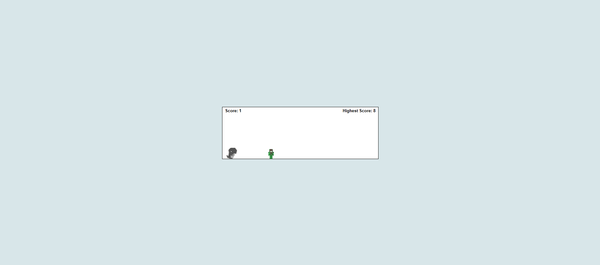
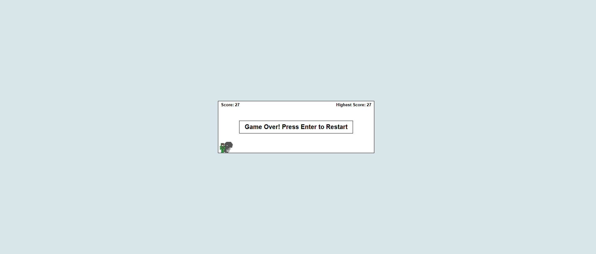

# Dino Run Game

A fun and interactive version of the classic Dinosaur Game, built with HTML, CSS, and JavaScript. The game features a jumping dinosaur that must avoid obstacles (cacti) and track the player's score. The game includes several advanced features like a countdown timer, dynamic speed increases, a day-night cycle, and the ability to save and display the highest score.

## Features

- **Jumping Dino**: The dinosaur can jump over incoming cacti by pressing the **Space** key or **Arrow Up** key.
- **Cactus Obstacles**: Cacti appear from the right side of the screen, and the player needs to jump to avoid them.
- **Score Tracking**: The score increases when the dinosaur successfully avoids cacti, and the score is displayed in the top-left corner. The highest score is saved in the browser's localStorage and displayed on the screen.
- **Speed Increase**: As the score increases, the game speed ramps up, making it progressively harder to avoid obstacles.
- **Day-Night Cycle**: The background alternates between day and night every time the player reaches a score multiple of 5.
- **Game Over Screen**: When the dinosaur collides with a cactus, a game over screen appears, and the game can be restarted by pressing the **Enter** key.

## Screenshots

### Day Mode

The game in daylight mode. The background is light, and the dinosaur is jumping over cacti.

### Night Mode

The game in nighttime mode. The background is dark, and the dinosaur continues to jump over cacti.

### Game Over Screen

The game over screen that appears after the dinosaur collides with a cactus. Press **Enter** to restart the game.

## How to Play

1. **Jump**: Press the **Space** key or **Arrow Up** key to make the dinosaur jump.
2. **Restart**: When the game is over, press the **Enter** key to restart the game.
3. **Toggle Day-Night Mode**: The background alternates between day and night automatically every time you reach a score multiple of 10.

## Files

- `index.html`: The main HTML structure of the game.
- `style.css`: The styles that define the look and feel of the game.
- `script.js`: The JavaScript logic controlling the game's mechanics, score tracking, day-night cycle, and collision detection.

## Game Mechanics

- **Jumping**: The dinosaur jumps with a smooth animation when the player presses the jump keys.
- **Cacti**: Randomly generated obstacles that the player must avoid. When the cactus moves past the dinosaur, the score increases.
- **Score**: The score is incremented every time the cactus passes the dinosaur. The highest score is stored in `localStorage`.
- **Game Over**: The game ends when the dinosaur collides with a cactus. The player can restart the game by pressing **Enter**.
- **Day-Night Cycle**: The background color changes between day (light) and night (dark) every 10 points scored.

## Key Functions

### `jump()`
Handles the dinosaur jump by adding a jump class that triggers the jump animation. The class is removed after the jump ends.

### `startGame()`
Starts the game, initializes variables like score and game state, and starts an interval for the game logic, including checking for collisions and updating the score.

### `endGame()`
Ends the game when a collision with the cactus is detected. The game stops the animations and shows the game over screen.

### `restartGame()`
Restarts the game by resetting necessary values and starting a new game.

### `updateHighestScore()`
Checks if the current score is higher than the highest score and updates the displayed highest score and stores it in `localStorage`.

### `toggleDayNight()`
Switches the background color between day (light) and night (dark) based on the player's score.

### Event Listeners
- **`keydown` event**: Listens for the **Space** or **Arrow Up** key to make the dinosaur jump. If the game is over, it listens for the **Enter** key to restart the game.

## Contributions

Feel free to fork the project, submit issues, or create pull requests. All contributions are welcome!

